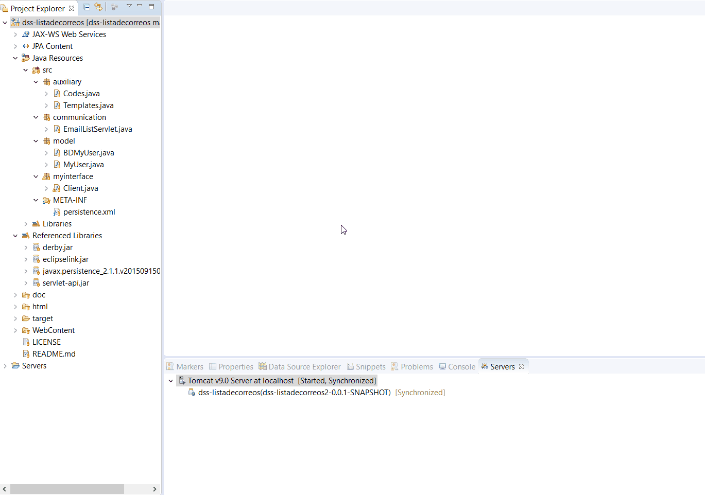

# Overview

Demo project using [JPA](https://www.ibm.com/support/knowledgecenter/es/SSAW57_liberty/com.ibm.websphere.wlp.nd.multiplatform.doc/ae/cwlp_jpa.html), [EclipseLink](http://www.eclipse.org/eclipselink/), [Apache Derby](https://db.apache.org/derby/) for deploying a database in a server and communicating with it through HTTP verbs.

# Showcase

# Installation

* Import to Eclipse as *Existing project*.
* Make sure Project>Properties>Project facets correspond with the image below.

* Make sure libraries on *WebContent/WEB-INF/lib/* are included on Build Path.
* A folder called *ddbb/* will be created on Desktop holding all the info of the dababase

# Run

See [showcase](https://github.com/gomezportillo/dss-listadecorreos#showcase) or

* EmailServlet.java _Run as > Run on Server_
* Client.java _Run as > Run as Java Application_

# Class diagram

